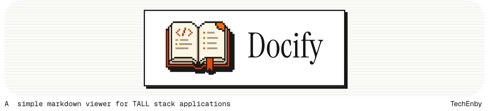

<picture>
    <source media="(prefers-color-scheme: dark)" srcset="artwork/banner-dark.png">
    
</picture>

[](https://packagist.org/packages/techenby/docify)
[](https://github.com/techenby/docify/actions?query=workflow%3Arun-tests+branch%3Amain)
[](https://packagist.org/packages/techenby/docify)

A simple markdown viewer for TALL stack applications

## Installation

You can install the package via composer:

```bash
composer require techenby/docify
```

Then run the install command to generate a docs folder:

```bash
php artisan docify:install
```

Optionally, you can publish the config and Livewire component and docs layout to configure the package for your application:

```bash
php artisan vendor:publish
```

## Usage

```
// Usage code and examples here
```

## Testing

```bash
composer test
```

## Releasing

Please see [RELEASE.md](RELEASE.md) for the release process.

## Contributing

Please see [CONTRIBUTING](CONTRIBUTING.md) for details.

## Security

If you discover any security related issues, please email andy@techenby.com instead of using the issue tracker.

## Credits

- [Andy Swick](https://github.com/techenby)
- [All Contributors](../../contributors)

## License

The MIT License (MIT). Please see [License File](LICENSE.md) for more information.
